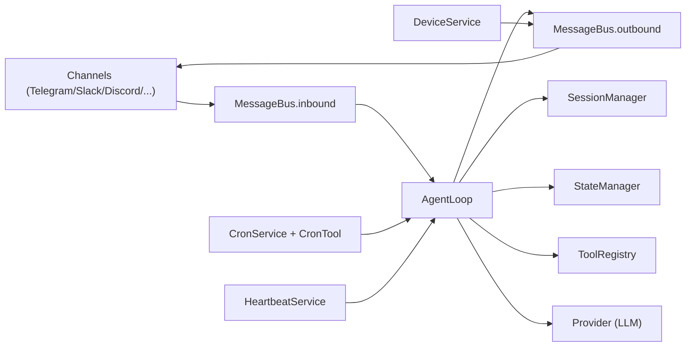

# PicoClaw Architecture Deep Read and Rust Port Blueprint

## 1. Objective

This document captures a code-first architecture reading of PicoClaw and turns it into a practical plan for building a Rust version of the agent software.

Goals:

1. Understand current runtime architecture and behavior from source code.
2. Identify limitations, risks, and design learnings.
3. Define a Rust target architecture with phased implementation.
4. Preserve useful behavior while improving safety, maintainability, and testability.

---

## 2. Reading Scope

Primary entry and composition:

- `cmd/picoclaw/main.go`

Core runtime:

- `pkg/agent/*`
- `pkg/tools/*`
- `pkg/providers/*`
- `pkg/channels/*`
- `pkg/bus/*`
- `pkg/config/*`
- `pkg/session/*`
- `pkg/state/*`
- `pkg/cron/*`
- `pkg/heartbeat/*`
- `pkg/devices/*`
- `pkg/skills/*`

Operational docs and defaults:

- `README.md`
- `workspace/*`

Test files were also read to infer intended behavior and edge cases.

---

## 3. High-Level Runtime Architecture

PicoClaw has two main runtime patterns:

1. CLI direct (`picoclaw agent`) for one-shot or interactive.
2. Gateway daemon (`picoclaw gateway`) for multi-channel bots with scheduler/event services.

### 3.1 Composition graph (gateway mode)

### 3.2 Data flow summary

1. Channel adapters normalize incoming events and publish `InboundMessage`.
2. `AgentLoop.Run` consumes inbound messages.
3. Agent builds prompt context (identity + bootstrap files + skills + memory + session history).
4. Agent calls provider with tool schemas.
5. If tool calls are requested, tool results are appended and the loop continues.
6. Final content is published outbound (unless message tool already sent directly).
7. Channel manager dispatches outbound message to channel-specific `Send`.

---

## 4. Core Functional Architecture

## 4.1 CLI and lifecycle composition (`cmd/picoclaw/main.go`)

The CLI command tree includes:

- `onboard`
- `agent`
- `gateway`
- `status`
- `auth`
- `cron`
- `skills`
- `migrate`

`gatewayCmd` composes all runtime services:

1. Load config.
2. Create provider via `providers.CreateProvider`.
3. Create bus.
4. Create `AgentLoop`.
5. Register `CronTool` and start `CronService`.
6. Create and start `HeartbeatService`.
7. Create and start `DeviceService`.
8. Create and start `channels.Manager`.
9. Start agent loop goroutine.
10. Block on interrupt and stop all services.

Design note:

- Composition is centralized in one file and is easy to follow.
- Dependency wiring is manual; no dependency injection container.

## 4.2 Agent runtime (`pkg/agent/loop.go`)

### Responsibilities

- Session-aware conversational loop.
- Tool-call iteration with max-iteration guard.
- Subagent/system message handling.
- Context updates for contextual tools.
- Session persistence and async summarization trigger.
- Last-channel recording for background notifications.

### Important internals

1. `createToolRegistry` builds and registers default tools.
2. `NewAgentLoop` creates:
   - Main tool registry
   - Subagent manager + separate subagent tool registry
   - Session manager
   - State manager
   - Context builder
3. `processMessage` routes:
   - `channel == "system"` -> `processSystemMessage`
   - otherwise -> `runAgentLoop`
4. `runAgentLoop`:
   - Load history and summary unless disabled.
   - Build provider messages.
   - Persist user message.
   - Run iterative LLM/tool loop.
   - Persist assistant output.
   - Trigger async summarization if threshold reached.
5. `runLLMIteration`:
   - Provider `Chat` call.
   - Append assistant tool-call message.
   - Execute tools.
   - Append tool result messages.
   - Repeat until no tool calls or max iterations reached.

### Summarization behavior

- Trigger if history length > 20 or estimated tokens exceed 75% of context window.
- Keeps last 4 messages after summary.
- Uses provider itself for summarization and merge.
- Skips oversized messages (>50% context window estimate).

## 4.3 Context assembly (`pkg/agent/context.go`, `pkg/agent/memory.go`)

System prompt is assembled from:

1. Core identity/runtime/tool section.
2. Bootstrap files: `AGENTS.md`, `SOUL.md`, `USER.md`, `IDENTITY.md`.
3. Skills summary (XML-like list with name/description/location/source).
4. Memory context:
   - `memory/MEMORY.md`
   - last 3 daily notes (`memory/YYYYMM/YYYYMMDD.md`)
5. Optional session summary and session metadata.

Design strength:

- Prompt composition is deterministic by section.

Design weakness:

- Builtin skills directory in `ContextBuilder` is derived from current working directory, not install/config root.

## 4.4 Tools subsystem (`pkg/tools/*`)

### Contracts

- `Tool` interface: name/description/schema/execute.
- Optional:
  - `ContextualTool` for channel/chat context.
  - `AsyncTool` with callback for completion.

### Registry

- `ToolRegistry` stores named tools, exposes:
  - provider tool definitions
  - execution with optional context and callback
  - summaries for prompt generation

### Built-in tools in main agent

- Filesystem: `read_file`, `write_file`, `list_dir`, `edit_file`, `append_file`
- Shell: `exec`
- Web: `web_search`, `web_fetch`
- Hardware: `i2c`, `spi`
- Messaging: `message`
- Delegation: `spawn` (async), `subagent` (sync)
- Scheduling: `cron` (registered in gateway composition)

### ToolResult model

Tool output explicitly distinguishes:

- `ForLLM`
- `ForUser`
- `Silent`
- `IsError`
- `Async`
- `Err` (internal only)

This is a good semantic model for a Rust port.

## 4.5 Subagents (`pkg/tools/spawn.go`, `pkg/tools/subagent.go`, `pkg/tools/toolloop.go`)

Two delegation modes:

1. `spawn`:
   - async task
   - returns immediately
   - background run posts a system inbound completion message
2. `subagent`:
   - synchronous delegation
   - caller waits and gets summarized result

Subagent execution reuses `RunToolLoop` in `pkg/tools/toolloop.go`.

Observation:

- Main agent has its own iterative loop implementation (`runLLMIteration`) instead of reusing `RunToolLoop`.

## 4.6 Providers (`pkg/providers/*`)

Provider contract:

- `Chat(ctx, messages, tools, model, options) -> LLMResponse`
- `GetDefaultModel()`

Implemented provider families:

1. OpenAI-compatible HTTP provider (`HTTPProvider`).
2. Native Anthropic SDK provider (`ClaudeProvider`).
3. Native OpenAI Responses API provider (`CodexProvider`).
4. CLI wrappers:
   - `ClaudeCliProvider`
   - `CodexCliProvider`
5. GitHub Copilot provider.

Provider selection (`CreateProvider`) supports:

- explicit provider selection from config
- model-prefix/model-name fallback inference
- OAuth/token auth flows for OpenAI/Anthropic
- codex-cli credential reuse (`~/.codex/auth.json`)

## 4.7 Channels (`pkg/channels/*`)

Channel model:

- `Channel` interface with `Start`, `Stop`, `Send`, `IsRunning`, `IsAllowed`.
- `BaseChannel` handles common allowlist and inbound normalization.
- `Manager` initializes enabled channels and dispatches outbound bus traffic.

Supported adapters include:

- Telegram
- Slack
- Discord
- LINE
- WhatsApp bridge
- DingTalk
- QQ
- OneBot
- Feishu (64-bit + stub for unsupported arch)
- MaixCam

Behavioral patterns across adapters:

- Convert platform events to `InboundMessage`.
- Optional media download + voice transcription path.
- Allowlist checks before heavy operations.
- Platform-specific chat/thread/group routing logic.

## 4.8 Persistence and background services

### Sessions (`pkg/session/manager.go`)

- JSON file per session under `workspace/sessions`.
- Atomic save via temp-file rename.
- Stores full assistant tool-call messages and tool outputs.
- Session filename sanitization for cross-platform compatibility.

### State (`pkg/state/state.go`)

- `workspace/state/state.json`.
- Tracks last channel/chat IDs and update timestamp.
- Atomic writes via temp-file rename.

### Cron (`pkg/cron/service.go`, `pkg/tools/cron.go`)

- Polling scheduler every second.
- Job store at `workspace/cron/jobs.json`.
- Schedules: one-time, every interval, cron expression.
- Jobs can:
  - deliver direct message
  - run shell command via exec tool
  - invoke agent processing

### Heartbeat (`pkg/heartbeat/service.go`)

- Periodic task prompt read from `workspace/HEARTBEAT.md`.
- Uses last active user channel from state for delivery.
- Can trigger async spawned work.
- Writes service-specific logs to `workspace/heartbeat.log`.

### Devices (`pkg/devices/*`)

- Optional USB event monitoring service.
- On Linux uses `udevadm monitor`.
- Routes notifications to last active user channel.

---

## 5. Persistent Data and Compatibility Surface

For migration/interop, these artifacts matter:

1. Config: `~/.picoclaw/config.json`
2. Workspace root:
   - `sessions/*.json`
   - `state/state.json`
   - `memory/MEMORY.md`
   - `memory/YYYYMM/YYYYMMDD.md`
   - `cron/jobs.json`
   - `HEARTBEAT.md`
   - bootstrap files (`AGENTS.md`, `SOUL.md`, etc.)

If Rust port should be drop-in compatible, preserve these file formats first.

---

## 6. Security and Safety Model (Current)

Security controls are mostly tool-level:

1. Filesystem path restriction via workspace check when enabled.
2. Exec denylist for destructive patterns.
3. Internal channel filtering (`cli`, `system`, `subagent`) to avoid user leakage.
4. Channel allowlists.

Risks:

- Enforcement is decentralized and inconsistent across subsystems.
- Some paths and providers bypass strict sandbox assumptions by design.

---

## 7. Limitations and Learnings from Current Design

This section is intentionally direct to inform Rust architecture decisions.

## 7.1 Correctness and behavior gaps

1. Agent loop ignores configured temperature and token options during runtime calls.
   - `runLLMIteration` uses hardcoded `max_tokens: 8192`, `temperature: 0.7`.
2. Duplicate tool-loop logic exists in two places.
   - `AgentLoop.runLLMIteration` and `tools.RunToolLoop` can drift.
3. `ForUser` tool outputs are mostly unused in the primary path.
   - `runLLMIteration` only sends `ForUser` when `SendResponse` is true; normal user path sets false.
4. Media is ingested by channels but not propagated into provider messages.
   - `BuildMessages` currently receives `nil` for media from caller.
5. Skills path resolution differs across code paths.
   - Context builder uses CWD-based builtin skills path, while CLI uses config-root-based paths.
6. `skills install-builtin` references a hardcoded path/list not aligned with current workspace skills.

## 7.2 Security and safety weaknesses

1. Filesystem restriction check uses simple prefix matching.
   - Potential false allow for sibling paths sharing prefix.
2. Exec guard is regex-based and can be bypass-prone by shell indirection.
3. CLI providers run with dangerous bypass flags (`codex`/`claude` wrappers), reducing runtime safety.
4. Config env overrides are not applied when config file is missing.
   - `LoadConfig` returns defaults early on missing file.

## 7.3 Concurrency and resilience concerns

1. Message bus uses bounded channels with blocking publish semantics.
   - Under slow consumers, producers can stall.
2. Cron store writes are not atomic.
   - Risk of file corruption on crash during write.
3. Some mutable fields in async paths are updated without explicit synchronization.
4. Channel manager logs per-channel start errors but does not fail fast.

## 7.4 Maintainability and architecture lessons

1. Good: explicit interfaces (`Tool`, `LLMProvider`, `Channel`) make porting tractable.
2. Good: clear subsystem boundaries in package layout.
3. Weak: composition-heavy logic concentrated in `main.go`.
4. Weak: heavy use of `map[string]interface{}` lowers type safety and schema clarity.
5. Weak: behavior contracts are spread between README, prompt text, and code.

---

## 8. Rust Target Architecture

## 8.1 Design principles for the Rust port

1. Keep behavioral parity for user-facing flows first.
2. Move safety from ad-hoc checks to centralized policy.
3. Replace dynamic maps with typed request/response structs and serde enums.
4. Keep async runtime explicit and testable.
5. Separate protocol adapters from core agent logic.

## 8.2 Suggested crate/module split

Option A: workspace with focused crates.

1. `picoclaw-core`
   - shared models (`InboundMessage`, `ToolResult`, session records)
   - traits (`Provider`, `Tool`, `ChannelAdapter`)
   - policy types (sandbox, guard decisions)
2. `picoclaw-agent`
   - agent loop
   - context builder
   - summarization
   - subagent manager
3. `picoclaw-tools`
   - filesystem/exec/web/cron/message/hardware tools
4. `picoclaw-providers`
   - openai-compatible HTTP
   - anthropic/openai SDK wrappers
   - CLI wrappers behind feature flags
5. `picoclaw-channels`
   - platform adapters (feature-gated)
6. `picoclaw-storage`
   - session/state/cron repositories
   - atomic file utilities
7. `picoclaw-app`
   - CLI and runtime composition

Option B: single crate with same internal module boundaries.

## 8.3 Suggested Rust trait model

Core traits:

1. `Provider`:
   - `chat(&self, request: ChatRequest) -> Result<ChatResponse>`
2. `Tool`:
   - `name()`, `schema()`, `execute(ctx, args) -> ToolResult`
3. `ToolRegistry`:
   - typed registration + schema export + dispatch
4. `ChannelAdapter`:
   - `start(inbound_tx)`, `send(outbound_msg)`, `stop()`
5. `SessionStore`, `StateStore`, `CronStore`:
   - trait-backed repositories for file/db variants

Use enums for tool call arguments/results when possible; keep generic JSON only at protocol edge.

## 8.4 Runtime/concurrency model

Recommended stack:

1. `tokio` runtime.
2. `tokio::sync::mpsc` for bus channels.
3. `tracing` + `tracing-subscriber` for structured logs.
4. `axum` or `warp` for webhook channels.
5. `reqwest` for HTTP clients.
6. `serde`/`serde_json` for data formats.

Backpressure strategy:

1. Define explicit bounded queue sizes.
2. On overflow, choose drop policy per queue type:
   - inbound: reject with metric + log
   - outbound: retry queue or dead-letter

## 8.5 Security architecture improvements for Rust

1. Centralize path policy in one `PathPolicy` module.
2. Use canonicalized path checks (`starts_with` on path segments, not string prefix).
3. Centralize exec policy with command parser/allowlist mode.
4. Make dangerous provider modes opt-in and feature-gated.
5. Enforce policy consistently across main agent, subagents, cron, heartbeat.

---

## 9. Rust Implementation Phases

## Phase 0: Specification and compatibility

Deliverables:

1. Finalize typed data models mirroring current JSON formats.
2. Golden test fixtures for:
   - session files
   - state file
   - cron jobs
   - provider/tool call transcripts

## Phase 1: Minimal agent parity (single-channel CLI)

Deliverables:

1. Core agent loop with tool iteration and max-iteration guard.
2. Filesystem + exec + message tools.
3. OpenAI-compatible HTTP provider.
4. Session/state persistence with atomic writes.

## Phase 2: Gateway and adapters

Deliverables:

1. Message bus daemon mode.
2. One channel adapter first (Telegram or Slack).
3. Outbound dispatcher and allowlist policy.
4. Heartbeat and cron service integration.

## Phase 3: Subagents and advanced tools

Deliverables:

1. Async spawn + sync subagent.
2. Web tools and provider function-call parity.
3. Optional hardware tools under Linux feature flag.

## Phase 4: Hardening and scale

Deliverables:

1. Unified tool loop implementation used by main + subagents.
2. Metrics, tracing, and reliability tests.
3. Strict policy enforcement and fuzz/property testing.

---

## 10. What to Keep vs Change

Keep:

1. Interface-first architecture (providers/tools/channels).
2. Workspace-centric persistence model.
3. Explicit agent-tool iterative loop.
4. Cron + heartbeat integration pattern.

Change:

1. Replace dynamic maps with typed structures.
2. Remove duplicated loop logic.
3. Move policy checks to centralized enforcement.
4. Make runtime options fully config-driven (no hardcoded LLM params).
5. Improve queue/backpressure and failure semantics.

---

## 11. Recommended Test Strategy for Rust Port

1. Unit tests for each tool and policy module.
2. Golden tests for prompt assembly and message history transformations.
3. Deterministic integration tests:
   - mock provider emits tool calls
   - verify iteration trace and tool dispatch order
4. Concurrency tests:
   - queue saturation
   - shutdown races
   - async subagent completion ordering
5. Security tests:
   - path traversal and sibling-prefix bypass cases
   - exec guard bypass attempts
6. Compatibility tests:
   - read existing PicoClaw workspace artifacts
   - run equivalent flows

---

## 12. Immediate Next Steps

1. Freeze MVP scope:
   - CLI + one provider + filesystem/exec/message tools + session/state.
2. Define Rust data contracts for:
   - messages
   - tool calls
   - session/state/cron JSON
3. Build the `picoclaw-core` + `picoclaw-agent` skeleton with mocked provider/tool registry.
4. Implement path/exec policy modules before adding channel/network integrations.

---

## 13. Appendix: Key Source Anchors

Runtime composition:

- `cmd/picoclaw/main.go`

Agent loop and context:

- `pkg/agent/loop.go`
- `pkg/agent/context.go`
- `pkg/agent/memory.go`

Tools:

- `pkg/tools/base.go`
- `pkg/tools/registry.go`
- `pkg/tools/result.go`
- `pkg/tools/toolloop.go`
- `pkg/tools/spawn.go`
- `pkg/tools/subagent.go`
- `pkg/tools/filesystem.go`
- `pkg/tools/shell.go`
- `pkg/tools/cron.go`
- `pkg/tools/web.go`

Providers:

- `pkg/providers/types.go`
- `pkg/providers/http_provider.go`
- `pkg/providers/claude_provider.go`
- `pkg/providers/codex_provider.go`
- `pkg/providers/claude_cli_provider.go`
- `pkg/providers/codex_cli_provider.go`

Channels and bus:

- `pkg/bus/bus.go`
- `pkg/bus/types.go`
- `pkg/channels/base.go`
- `pkg/channels/manager.go`
- `pkg/channels/*.go`

Persistence/background:

- `pkg/session/manager.go`
- `pkg/state/state.go`
- `pkg/cron/service.go`
- `pkg/heartbeat/service.go`
- `pkg/devices/service.go`

